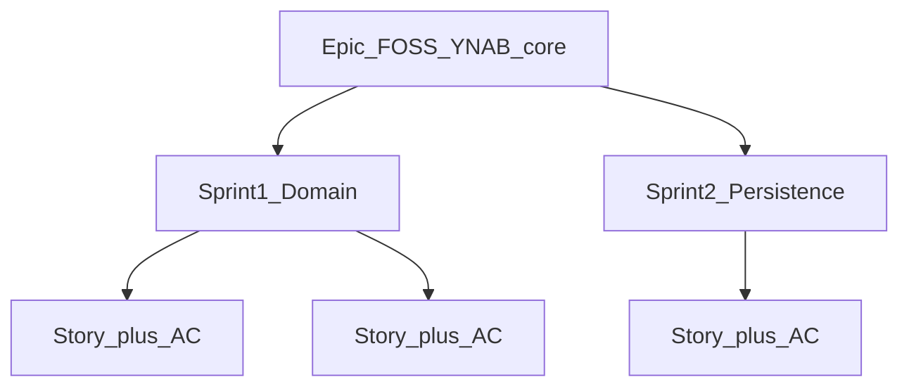

# YNAB Clone — project plan

**Repo copy for handoff:** Mention `@docs/PROJECT_PLAN.md` (and `@.cursor/rules/collaboration.mdc`) in new chats. Cursor may also track the plan as **YNAB Clone Roadmap** in the IDE **Plans** panel (`ynab_clone_roadmap_36f6449d.plan.md` under your user `.cursor/plans/`). When you change the roadmap, update **either** this file **or** the Cursor plan and keep them aligned.

## Overview

Roadmap for a FOSS, self-hostable YNAB-like app (domain → persistence → API → web UI), using **Epic → Sprint → Story → Acceptance Criteria**. Each **story** targets **under ~150 lines** (production + tests) with **AC** defining done. You implement; the assistant guides unless you explicitly ask for implementation.

## High-level backlog (epic todos)

| ID | Track |
|----|--------|
| Epic scope | Document MVP (accounts + transactions + budgets, manual import) and non-goals (no bank sync, no multi-user auth in MVP). |
| Foundation | `internal/budget` domain from clean slate. |
| Tests | Domain tests across many small stories. |
| Persistence | `internal/store` + SQLite + migrations. |
| API server | Real HTTP server in `cmd/api`. |
| API MVP | CRUD + budget summary endpoints. |
| Web MVP | UI for accounts / transactions / budgets. |
| Import | CSV/manual import (post-MVP slice). |
| QA | E2E flow: allocate → txn → balances. |
| Roadmap next | Rules, goals, reports, future bank sync. |
| FOSS metadata | LICENSE, CONTRIBUTING, architecture doc. |
| Plan mirror | This file + README pointer (done if you’re reading this). |
| Collaboration | `.cursor/rules/collaboration.mdc` (canonical for agent). |

---

## Epic goal

Ship a working, self-hostable YNAB-like budgeting system (FOSS) that supports the core budgeting loop: maintain accounts, record transactions, and manage budgets/allocations with correct “available” math—starting with manual import and growing toward richer YNAB concepts.

## How we’ll work (collaboration model)

- **Canonical defaults for the agent:** [`.cursor/rules/collaboration.mdc`](../.cursor/rules/collaboration.mdc) (`alwaysApply: true`)—this document is a summary; keep them aligned if you change the rule.
- **You write the code** in your repo; the assistant **does not** modify application source by default (planning docs and the plan file may be updated when refining goals).
- The assistant **guides** with: what to build next, suggested package layout, APIs/data shapes, step-by-step tasks, pitfalls (rounding, invariants), and **review** of what you paste or commit.
- When you want hands-on implementation from the assistant, say so explicitly (e.g. “implement Sprint 1 domain package for me”); otherwise assume **guide-only**.

## Continuity across new chats (handoff)

New Composer/Agent chats do **not** reliably inherit full prior thread context. Use this so the assistant can pick up quickly:

1. **@ this file** — e.g. *“Read `@docs/PROJECT_PLAN.md` and `@.cursor/rules/collaboration.mdc`.”*
2. **Re-open the Cursor plan** when you want the session tied to **YNAB Clone Roadmap** in the **Plans** UI; merge edits back into this repo file when convenient.
3. **Open with three facts** — **current sprint + story ID** (e.g. S1-03), **what’s done** (one line), **what’s next or blocked**.
4. **Git** — Small commits per story (`git log` shows where you left off).
5. **README** — Points here for the roadmap (see repo root [README.md](../README.md)).

## Why this repo shape matters

Right now the repo is a **minimal skeleton** (previous `internal/` packages were removed on purpose):

- `cmd/api/main.go` only prints `Hello, World!` (or similar placeholder)
- No `internal/` packages yet—you will introduce them as you start Sprint 1+ (e.g. `internal/budget`, then `internal/store`, etc.)
- There’s no budget/account/transaction domain code yet

So the first epic sub-plans should focus on establishing architecture, domain invariants, and end-to-end slices—**you** ship each slice; the assistant helps you decompose and validate.

## Work breakdown: Epic → Sprint → Story → Acceptance Criteria

- **Epic:** Long-lived goal (this document’s theme—FOSS YNAB-like core).
- **Sprint:** Time-boxed or themed chunk of work (e.g. “domain foundation”, “persistence”).
- **Story:** The **smallest implementable slice** you deliver in one go; this is what the **~150 LOC** rule applies to (**production + tests** changed for that story). If a slice would exceed ~150 lines, **split into another story** (e.g. types-only story, then one function + tests story).
- **Acceptance Criteria (AC):** The **definition of done** for that story—explicit, checkable (e.g. “`go test ./...` passes”, “function X returns error for negative amount”, “no new imports of `net/http` in `internal/budget`”). A story is **not** complete until AC is satisfied.

### ~150 LOC constraint (applies to **Story**, not the whole Sprint)

- **How to count (pick one convention and keep it):** e.g. `wc -l` on `.go` files touched for that story, or non-empty non-comment lines—consistency matters more than precision.
- **Why:** Small stories + clear AC keep learning and review tractable.

## Target architecture (high level)

```mermaid
flowchart LR
  UI[Web UI] -->|HTTP JSON| API[Go API]
  API --> DOMAIN[Budget Domain (pure logic)]
  DOMAIN --> STORE[Persistence (SQLite)]
  STORE --> DOMAIN
  DOMAIN --> API
  API --> UI
```

## Agile structure (Epic → Sprint → Story → AC)

Maintain one **Epic**, break work into **Sprints** (themes). Each sprint below lists **Stories** in implementation order; each story includes **Acceptance Criteria (AC)**. Every story should stay **<~150 LOC** (production + tests for that story)—if not, split the story.

**Shared conventions (document in code comments when you implement):**

- **Money:** integer **signed cents** (no floats) in the domain layer.
- **Month key:** `YYYY-MM` string or dedicated type—pick one and use consistently in API + store.
- **Category available (MVP):** for a month, `AvailableCents = BudgetedCents + ActivityCents`, where `ActivityCents` is the sum of **signed** amounts of transactions **assigned to that category** in that month (adjust if you later split “TBB” / credit handling—then update this plan).

---

### Sprint 1 — Domain (pure Go, no HTTP/SQL)

**Sprint goal:** `internal/budget` models + pure functions + tests; **no** `net/http`, **no** SQL/driver imports in this package.

#### Story S1-01 — `Money` (signed cents)

- **AC:** Type represents signed cents; helpers or methods for add/subtract (or clear rules for operators) without float conversion.
- **AC:** Tests cover at least: zero, positive, negative, and one overflow/underflow or “bounded op returns error” case (choose one policy and test it).
- **AC:** `go test ./internal/budget/...` passes; story diff stays **<~150 LOC** (prod + tests).

#### Story S1-02 — Strong IDs (no primitive obsession)

- **AC:** Distinct types for `AccountID`, `CategoryID`, `TransactionID` (or equivalent) so signatures don’t mix raw strings accidentally.
- **AC:** Tests prove distinct types don’t assign across each other at compile time (or document pattern if you use typed structs only).
- **AC:** `go test ./internal/budget/...` passes; **<~150 LOC**.

#### Story S1-03 — `Account` aggregate (minimal)

- **AC:** `Account` holds at least: `ID`, `Name`, `BalanceCents` (or your chosen single balance field for MVP).
- **AC:** Constructor/factory validates `Name` non-empty (and any other invariants you declare).
- **AC:** Tests for valid create + validation failure path(s); **<~150 LOC**.

#### Story S1-04 — `Category` aggregate (minimal)

- **AC:** `Category` holds at least: `ID`, `Name`.
- **AC:** Validation on `Name` (and any other declared invariants).
- **AC:** Tests for valid create + validation failure; **<~150 LOC**.

#### Story S1-05 — `Transaction` + posting to **account** balance

- **AC:** `Transaction` includes at least: `ID`, `AccountID`, optional `CategoryID`, signed `AmountCents`, `Date` (type of your choice), `Payee` (string OK).
- **AC:** Pure function `ApplyTransactionToAccount(a Account, t Transaction) (Account, error)` updates **account** balance by signed amount; rejects invalid combo (define at least one rule, e.g. zero amount invalid).
- **AC:** Tests: inflow increases balance, outflow decreases, error cases; **<~150 LOC**.

#### Story S1-06 — Monthly assignment + category **activity**

- **AC:** Pure function computes **activity cents** for a category/month from a slice of transactions (filter by `CategoryID` + month).
- **AC:** Tests include transactions outside month excluded; uncategorized transactions excluded from category activity.
- **AC:** **<~150 LOC**.

#### Story S1-07 — `BudgetLine` + **available** helper

- **AC:** Type or struct represents per `(CategoryID, Month)` values: `BudgetedCents` plus computed `ActivityCents` input → `AvailableCents` via shared convention above.
- **AC:** Tests: budgeted 100_00, activity -30_00 → available 70_00 (adjust signs if you invert convention—tests must match your rule).
- **AC:** **<~150 LOC**.

#### Story S1-08 — **Allocate** (increase budgeted)

- **AC:** Pure function `Allocate(line BudgetLine, amountCents int64) (BudgetLine, error)` (names flexible) increases `BudgetedCents`; rejects negative/zero per your policy.
- **AC:** Tests: successful allocate + at least one invalid input error.
- **AC:** **<~150 LOC**.

#### Story S1-09 — Multi-transaction consistency (light integration in tests)

- **AC:** One test (or small group) builds 2–3 transactions across categories/month edge and asserts correct **activity** and **available** when combined with a budget line.
- **AC:** No new imports beyond stdlib + `internal/budget` test package patterns you already use.
- **AC:** **<~150 LOC** (split into S1-10 if needed).

#### Story S1-10 — Table-driven regression tests (optional split)

- **AC:** Table of ≥5 rows covering tricky cases (month boundary, negative activity, zero budgeted, large cents).
- **AC:** Each row comment or name documents the rule it locks in.
- **AC:** **<~150 LOC**; if over, move rows to next story.

---

### Sprint 2 — Persistence (SQLite + repositories)

**Sprint goal:** durable storage with **migrations** + repos for accounts, categories, transactions, budget lines; `:memory:` or temp-file tests.

#### Story S2-01 — DB open + migration runner

- **AC:** Open SQLite with chosen driver; `schema_migrations` (or equivalent) tracks applied versions.
- **AC:** `ApplyMigrations(fs embed.FS)` (or your API) is idempotent: second run no-ops / no error.
- **AC:** Tests use `:memory:` (or temp file); **<~150 LOC**.

#### Story S2-02 — Migration: `accounts` table + account repo (create/list/get)

- **AC:** SQL migration creates `accounts` with `id`, `name`, `balance_cents` (or your S1 fields).
- **AC:** Repo methods: `CreateAccount`, `GetAccount`, `ListAccounts` (minimum).
- **AC:** Round-trip test: create → get → equals; **<~150 LOC**.

#### Story S2-03 — Migration: `categories` + category repo

- **AC:** Migration creates `categories` (`id`, `name`, …).
- **AC:** Repo: `CreateCategory`, `ListCategories` (and `Get` if needed).
- **AC:** Tests round-trip; **<~150 LOC**.

#### Story S2-04 — Migration: `transactions` + transaction repo

- **AC:** Migration creates `transactions` matching domain needs (`account_id`, nullable `category_id`, `amount_cents`, `date`, `payee`, …).
- **AC:** Repo: `CreateTransaction`, `ListTransactionsForAccount` (minimum).
- **AC:** Tests prove persisted rows reload with correct signs/null category; **<~150 LOC**.

#### Story S2-05 — Migration: `budget_lines` + repo

- **AC:** Table keyed by `(category_id, month)` unique; stores `budgeted_cents`.
- **AC:** Repo: `UpsertBudgetLine`, `ListBudgetLinesForMonth`.
- **AC:** Tests upsert updates same row; **<~150 LOC**.

#### Story S2-06 — “Read model” helpers wired to domain (no HTTP)

- **AC:** Pure helper or small service in `internal/store` (or `internal/budget` adapter) that loads txns + budget lines for a month and returns **available** per category using Sprint 1 functions.
- **AC:** Integration test: seed DB → query → assert available matches hand-calculated expectation.
- **AC:** **<~150 LOC** (split if heavy).

---

### Sprint 3 — HTTP API (JSON)

**Sprint goal:** REST-ish JSON API over Sprint 2 repos + Sprint 1 domain; manual `curl` demo works.

#### Story S3-01 — Server skeleton + config

- **AC:** `cmd/api` starts HTTP server on configurable port (env var with default, e.g. `8080`).
- **AC:** Graceful-ish shutdown optional; at minimum `ListenAndServe` works.
- **AC:** **<~150 LOC**.

#### Story S3-02 — `GET /health`

- **AC:** Returns `200` with small JSON/text body.
- **AC:** `httptest` or integration test hits handler; **<~150 LOC**.

#### Story S3-03 — Accounts API

- **AC:** `POST /accounts` creates account (JSON body); `GET /accounts` lists.
- **AC:** `400` on bad JSON/body; persistence round-trip.
- **AC:** Tests with `httptest`; **<~150 LOC** (split list vs create if needed).

#### Story S3-04 — Categories API

- **AC:** `POST /categories`, `GET /categories` analogous to accounts.
- **AC:** Validation errors → `400`; tests; **<~150 LOC**.

#### Story S3-05 — Transactions API

- **AC:** `POST /transactions` creates transaction affecting account balance in DB (per your domain rules).
- **AC:** `GET /transactions?account_id=…` lists for account (define ordering: date desc OK).
- **AC:** Tests cover categorized + uncategorized; **<~150 LOC** (split POST vs GET if needed).

#### Story S3-06 — Budget allocate API

- **AC:** Endpoint allocates budgeted cents to a category for a month (e.g. `POST /budget/{YYYY-MM}/allocate` with `category_id` + `amount_cents`).
- **AC:** Idempotent or additive behavior documented in handler comment + tested.
- **AC:** **<~150 LOC**.

#### Story S3-07 — Budget summary API

- **AC:** `GET /budget/{YYYY-MM}/summary` returns per category: `budgeted_cents`, `activity_cents`, `available_cents`.
- **AC:** Matches Sprint 1 math on seeded data (test).
- **AC:** **<~150 LOC**.

#### Story S3-08 — Consistent JSON errors

- **AC:** Central helper writes JSON error shape `{ "error": "..." }` (or similar) for `400`/`404`/`500`.
- **AC:** At least one test asserts error JSON on bad request.
- **AC:** **<~150 LOC**.

#### Story S3-09 — CORS (only if UI origin differs)

- **AC:** If SPA runs on another port/host, middleware sets minimal CORS headers for dev.
- **AC:** Document “dev only” in comment; **<~150 LOC**. (Skip story if same-origin proxy.)

---

### Sprint 4 — Web UI MVP

**Sprint goal:** browser UI for accounts, categories, transactions, budget summary; calls Sprint 3 API. (Stack is yours—React/Vue/Svelte/htmx; stories assume a SPA or simple MPA.)

#### Story S4-01 — UI project scaffold + dev proxy

- **AC:** UI dev server runs; API reachable (proxy or documented `VITE_*` / env base URL for your stack).
- **AC:** README snippet: commands to run API + UI together.
- **AC:** **<~150 LOC** (config + minimal app shell only if that exceeds limit, split scaffold vs README).

#### Story S4-02 — API client module

- **AC:** Shared functions for `GET/POST` JSON with typed errors on non-2xx.
- **AC:** One test (if you have a JS test runner) **or** documented manual check; if no JS tests, AC is manual + consistent error handling in UI later.
- **AC:** **<~150 LOC**.

#### Story S4-03 — Accounts screen

- **AC:** Lists accounts from `GET /accounts`; form `POST /accounts` creates and refreshes list.
- **AC:** Manual AC: create two accounts, see both listed.
- **AC:** **<~150 LOC**.

#### Story S4-04 — Categories screen

- **AC:** List + create analogous to accounts.
- **AC:** Manual AC: create category used later in transactions.
- **AC:** **<~150 LOC**.

#### Story S4-05 — Transactions screen

- **AC:** Create transaction (account, amount, date, payee, optional category); list filtered by selected account or global list (match your API).
- **AC:** Manual AC: expense reduces account balance in UI display if you show balance, or verify via account refresh.
- **AC:** **<~150 LOC** (split form vs list if needed).

#### Story S4-06 — Budget screen (month + summary)

- **AC:** User picks month (`YYYY-MM` input); UI loads `GET /budget/{month}/summary`.
- **AC:** UI can allocate (calls Sprint 3 allocate endpoint) and refreshes summary.
- **AC:** Manual AC: allocate + enter txn → available changes as expected.
- **AC:** **<~150 LOC** (split pick-month vs table if needed).

#### Story S4-07 — Navigation / layout shell

- **AC:** Single app shell links/tabs to Accounts, Categories, Transactions, Budget.
- **AC:** Manual smoke: navigate all four without full reload breaking state catastrophically.
- **AC:** **<~150 LOC**.

---

### Sprint 5 — Reporting + polish

**Sprint goal:** one useful report + UX hardening.

#### Story S5-01 — Spending report API

- **AC:** `GET /reports/spending?from=YYYY-MM-DD&to=YYYY-MM-DD` returns totals per `category_id` (skip uncategorized or bucket as `null`—document choice).
- **AC:** Tests with seeded transactions spanning range boundaries.
- **AC:** **<~150 LOC**.

#### Story S5-02 — Spending report UI

- **AC:** Page/section displays API results in a table; sorts by amount desc or alphabetically (pick one, document).
- **AC:** Manual AC: empty range shows clear message.
- **AC:** **<~150 LOC**.

#### Story S5-03 — Client-side form validation

- **AC:** Required fields on create forms show inline errors **before** submit OR disable submit until valid.
- **AC:** Still handles API `400` gracefully (shows message).
- **AC:** **<~150 LOC**.

#### Story S5-04 — Empty states

- **AC:** Accounts/Categories/Transactions/Budget views each show helpful empty copy when no data.
- **AC:** Manual check each route with fresh DB.
- **AC:** **<~150 LOC**.

#### Story S5-05 — Loading + error states

- **AC:** Mutations/lists show loading indicator (spinner/text) during fetch.
- **AC:** Failed fetch shows user-visible error (not only `console.error`).
- **AC:** **<~150 LOC**.

#### Story S5-06 — Docs + demo script

- **AC:** README “happy path”: create account → category → allocate → add txn → see budget summary + report numbers align.
- **AC:** No code beyond tiny doc tweaks if possible; if doc-only, LOC limit applies loosely—keep the story tiny.

---

### Next epics (post-MVP roadmap)

- Manual import (CSV) flows (since bank sync is “manual import only” for now)
- Overspending/“rules” and goals (basic variants)
- More YNAB-like budgeting behaviors and richer reports

## Concrete repo work items anchored to current files

- **You** replace `cmd/api/main.go` with a real server entrypoint (router + dependency wiring) when you reach Sprint 3.
- **You** create `internal/` packages as needed (clean slate):
  - `internal/budget` (domain)
  - `internal/store` (persistence)
  - `internal/api` (handlers + DTOs)
  - `internal/importer` (CSV/manual import later)
- **You** expand tests so core math is fully covered before UI; the assistant can suggest test cases and invariants to assert.

## Mermaid: hierarchy and sprint themes




